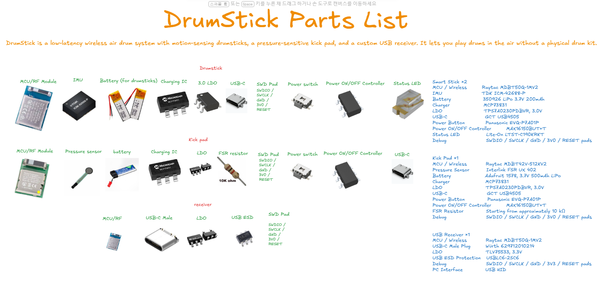
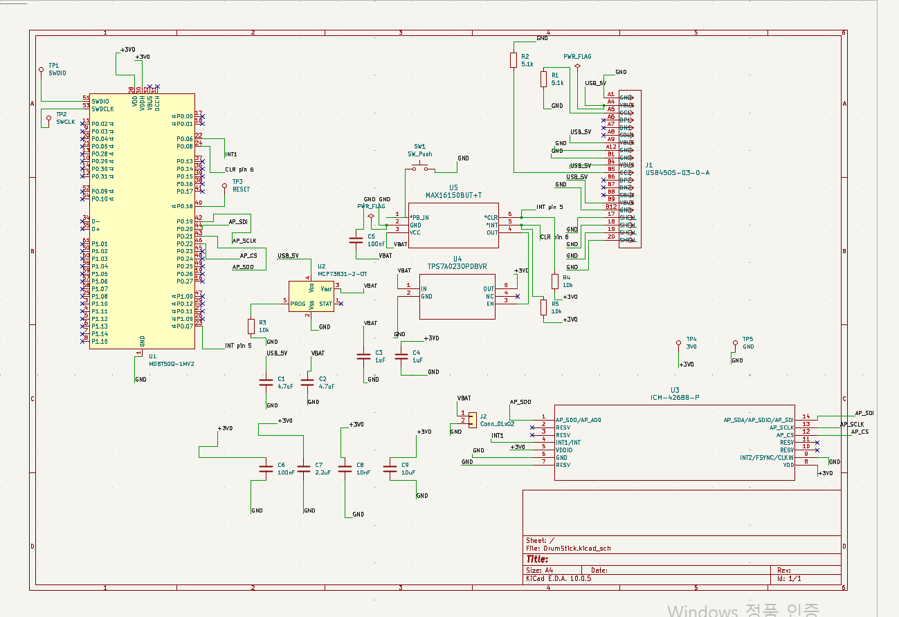
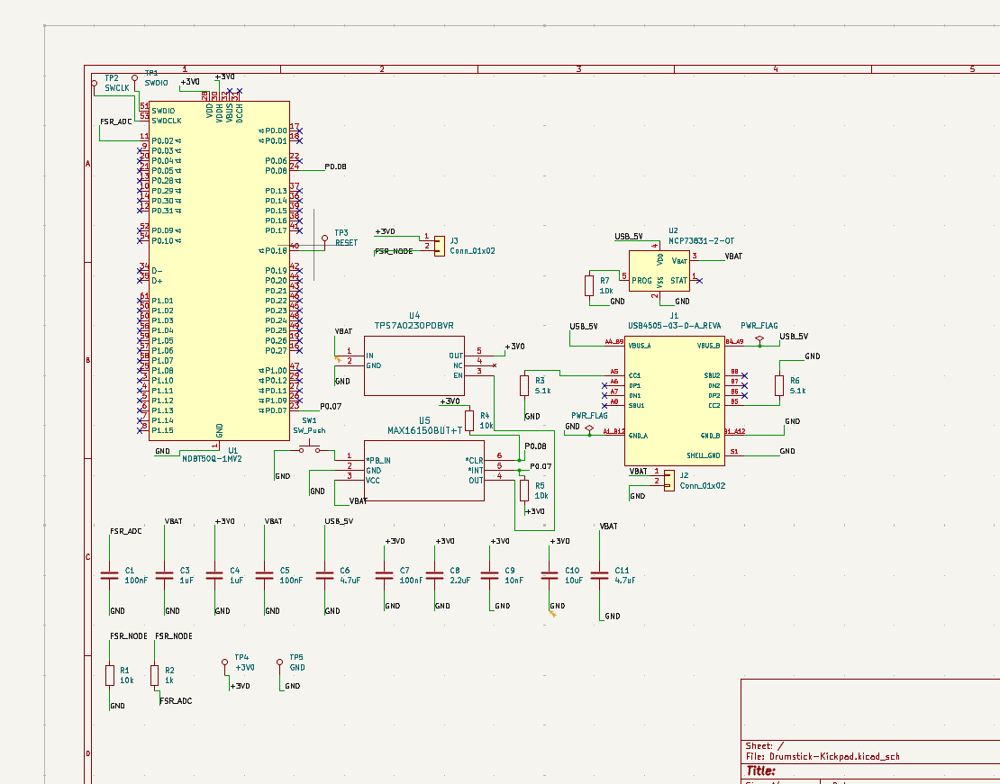
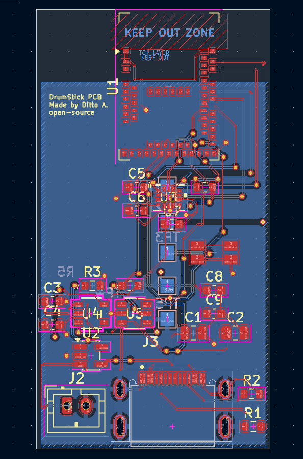
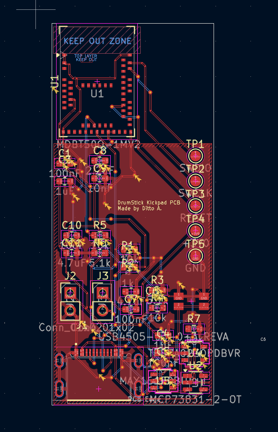

# September 14: Product component selection, organization, and planning

I researched and selected all the necessary components—ranging from those for the drumstick PCBs to the receiver that captures the signals and the kick pad. 

Since the components had to fit within the compact form factor of a drumstick, the selection process was time-consuming, but I ultimately chose the smallest available parts.

**Total time spent: 2 hours**

# September 17: I created a circuit diagram using drumstick parts.

I created the schematic in KiCad using the components I had selected beforehand.

I encountered an error during the process and resolved it by editing the symbol—something I had never done before. I plan to handle footprint assignment and the PCB layout tomorrow.

**Total time spent: 4 hours**

# September 19: Footprint and PCB Fabrication
Today, I drew the circuit diagram for the drum kick pad.

I decided to copy and paste the footprints and symbols of the parts used on the drumsticks,
which caused footprint errors, so it took a long time to fix them. 
I am reposting this because, while deleting duplicate journal entries, I accidentally deleted some that should not have been removed.

**Total time spent: 6 hours**

# September 20: Footprint and PCB Fabrication
Today, I added footprints to all the components and designed the PCB.

I struggled for three hours trying to route the USB-C connector section, only to discover that it was simply a board setting issue...

I also finished the PCB for the drum's kick pad.

**Total time spent: 12 hours**

